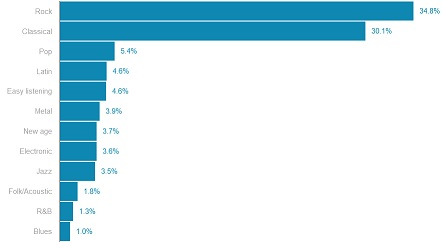
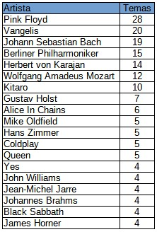
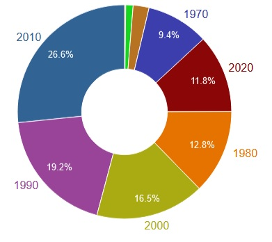

# Playlist-musica-de-Universo-en-Expansion
Cómo se creó y detalles adicionales del Playlist de la música del programa de radio Universo en Expansión de Radio Bolivariana y la Universidad de Antioquia

Encuentre el playlist [aquí](https://open.spotify.com/playlist/1hgaCN4QIEZR2faOjnlnjA?si=b71739ccb1f04a8e)

Universo en Expansión en [iVoox](https://www.ivoox.com/en/podcast-universo-expansion-profs-p-cuartas-a-ruiz_sq_f1398704_1.html)

Universo en Expansión en [Facebook](https://www.facebook.com/ProgramaUniversoEnExpansion)

Emisora [Radio Bolivariana](https://www.radiobolivarianavirtual.com/)

## Qué es esto?

Una explicación rápida de como se generó el playlist, sus contenidos y algunas estadísticas.

## Porqué?

Con más de 1000 programas y en cada uno de ellos con música de buena calidad siempre existió el interés de tener una lista de reproducción de esa música.... y bueno, Andrés Ruíz puso el reto ;-) 

## Cómo se hizo?

Ante la tarea casi imposible de escuchar de nuevo todos los programas, extraer la música y crear la lista, se usó un sistema automático similar a Shazam, que identificaba los temas musicales y los adicionaba a la lista. Herramientas:

- Computador corriendo en Linux Mint
- Grabaciones de los programas en Mixcloud y iVoox
- Software identificador [SongRec](https://github.com/marin-m/SongRec)
- Servicio para [actualizar la lista de manera masiva](https://www.tunemymusic.com/transfer)

El proceso consiste en el computador corriendo 24 horas, todos los dias, reproduciendo los episodios en iVoox y Mixcloud e identificando los temas musicales, con ese resultado, y luego de alguna limpieza manual, se actualiza la lista en Spotify. A partir de Octubre 5 de 2024, la lista se actualiza manualmente de manera semanal. El proceso automático tomó aproximadamente 1 mes.

## Estadísticas para ñoños: (A Noviembre 3 de 2024)

Capítulos procesados:472 (Mixcloud:116, iVoox:356)
541 temas por 505 artistas. 
Duración: 49 horas 14 minutos

Estilo: Acústico

Género predominante: Rock

Sub-genero Predominante: Clásica

Artista más frecuente: Pink Floyd

Década predominante: 2010s	

Clave musical predominante: D (Re)

### Géneros musicales y su distribución

### Artistas y su distribución

### Décadas de los temas musicales

Aquí la [lista completa en Excel](docs/UniversoEnExpansionListaCompleta.xlsx)

## Limitaciones:

No ha sido posible identificar el 100% de los temas musicales por las siguientes razones:

- No todos los programas están disponibles: Yo grabé y publiqué 116 programas en Mixcloud y hay 490 en iVoox, pero hay otros que no están en Internet.

- El sistema usado no es perfecto y no logra identificar correctamente los temas musicales sobre todo si ls duración en el programa no es muy larga.

- Es posible que existan temas mal identificados. Se ha hecho una limpieza de los resultados pero es posible que existan algunos temas que no corresponden pero a la fecha debe ser un porcentaje muy bajo.

